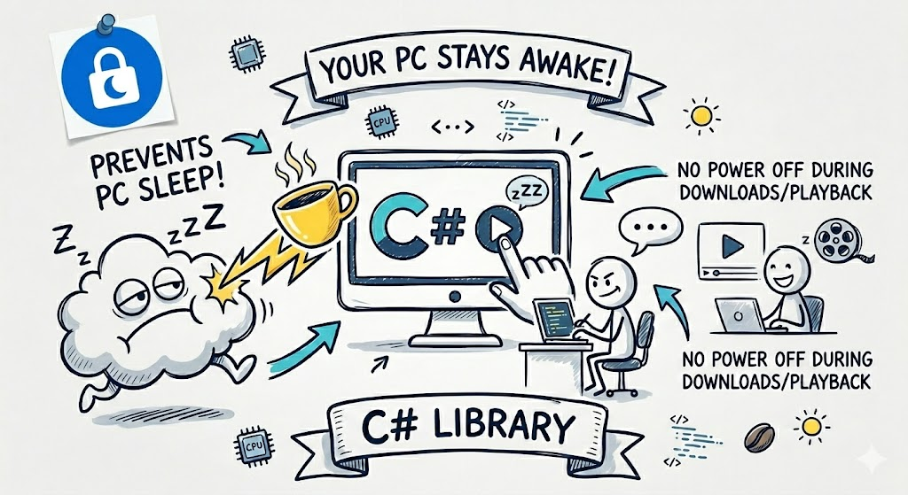

# WakeLock

[](https://github.com/capjan/WakeLock/actions/workflows/build.yml)
[](https://github.com/capjan/WakeLock/actions/workflows/test.yml)
[](https://www.nuget.org/packages/Capjan.WakeLock.Abstractions)
[](https://www.nuget.org/packages/Capjan.WakeLock.Windows)
[](https://www.nuget.org/packages/Capjan.WakeLock.MacOS)
[](https://www.nuget.org/packages/Capjan.WakeLock.Linux)
[](https://dotnet.microsoft.com/en-us/download/dotnet/10.0)

Cross-platform .NET wake lock libraries for preventing system sleep and, optionally, display sleep.

  
AI Generated: WakeLock Use Case Doodle

## Examples

<details>
<summary><strong>Windows</strong></summary>

Install:

```bash
dotnet add package Capjan.WakeLock.Windows
```

Use:

```csharp
using Capjan.WakeLock;

using var wakeLock = new WindowsWakeLockService();
using var handle = wakeLock.Acquire(WakeLockLevel.PreventSleep);
```

</details>

<details>
<summary><strong>macOS</strong></summary>

Install:

```bash
dotnet add package Capjan.WakeLock.MacOS
```

Use:

```csharp
using Capjan.WakeLock;

using var wakeLock = new MacOSWakeLockService();
using var handle = wakeLock.Acquire(WakeLockLevel.PreventSleep);
```

</details>

<details>
<summary><strong>Linux</strong></summary>

Install:

```bash
dotnet add package Capjan.WakeLock.Linux
```

Use:

```csharp
using Capjan.WakeLock;

using var wakeLock = new LinuxWakeLockService();
using var handle = wakeLock.Acquire(WakeLockLevel.PreventSleep);
```

</details>

> [!NOTE]
> - Keep the returned handle alive as long as you want the wake lock active.
> - Dispose the handle to release one acquisition.
> - Dispose the service to release all active acquisitions.
> - Use `WakeLockLevel.PreventSleepAndDisplay` if display sleep should be prevented too.
> - Use [`Capjan.WakeLock.Abstractions`](https://www.nuget.org/packages/Capjan.WakeLock.Abstractions) if you only want the shared API (`IWakeLockService`, `WakeLockLevel`).

## Building

```bash
dotnet build WakeLock.slnx
dotnet pack WakeLock.slnx --configuration Release
```

## License

Permissive MIT license (see [LICENSE](./LICENSE)) that allows commercial and open-source use with minimal obligations.
